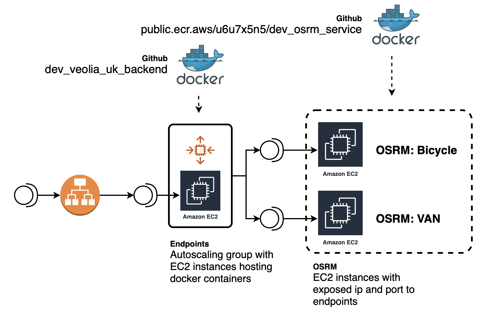
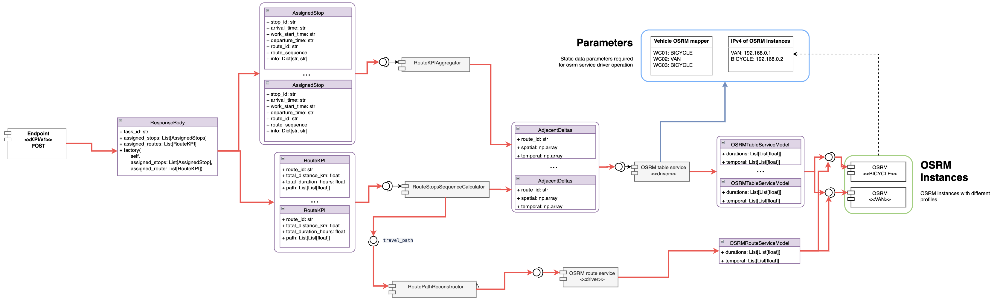

# **Dev veolia uk backend** 🚛

Project of routing optimisation platform for Veolia. Given repository is created for backend development

## Infrastructure

----

## Setup development environment

----

1. Create envrionment using any env managment solution
2. Execute command under created environment: `make env_configure`
