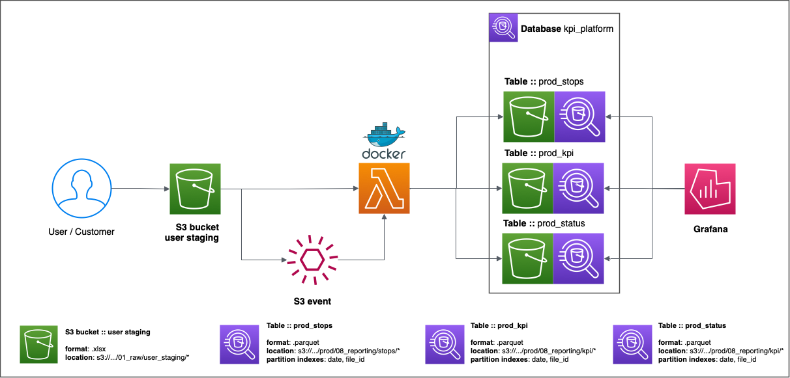

# **DEV KPI CALCULATION PLATFORM** 🚛

[Design documentations](https://wastelabs.almanac.io/docs/kpi-calculation-platform-design-doc-bdSdV5xEtGKTndzzeFaVPIw67Tfs3IT9?docView=Editing)

Demo project for potential customers computing route main KPIs

## **Platform desing**

----

## **Setup development environment**

----

1. Create envrionment using any env managment solution
2. Execute command under created environment: `make env_configure`
